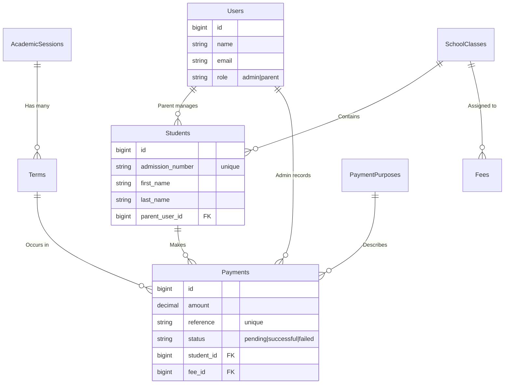

# Spiritan Digital Financial Management System - Architecture

This document provides a high-level overview of the architecture, technology stack, and application configuration for the Spiritan Digital Financial Management System (DFMS).

## 1. System Overview

The Spiritan DFMS is a monolithic web application structured around the MVC (Model-View-Controller) pattern. It is designed to track student tuition fees, manage payments reliably, generate electronic receipts, and provide an overview of school finances. 

The system leverages a traditional server-rendered architecture. It serves dynamic HTML pages from the server and performs database operations through an Object-Relational Mapper (ORM). 

## 2. Technology Stack

### Backend Framework
*   **Language**: PHP 8.2+
*   **Framework**: Laravel 12
    *   *Why Laravel?* Laravel provides robust out-of-the-box solutions for routing, authentication, ORM (Eloquent), and templating (Blade). Its ecosystem is perfect for building reliable financial portals rapidly.

### Frontend
*   **Templating Engine**: Laravel Blade
*   **Styling**: Bootstrap 5.3 + Custom CSS (Material Design 3 aesthetic)
    *   *Why Bootstrap?* Provides a reliable, responsive grid and pre-built components that accelerate UI development. Custom CSS variables (`--md-primary`, etc.) are layered on top to create a unique, premium design identity (the "Spiritan Blue Theme").
*   **JavaScript**: Vanilla JS for dynamic form interactions (e.g., fetching students based on the selected class via AJAX) and Bootstrap's Bundle JS for component behavior (modals, dropdowns).

### Database Layer
*   **RDBMS**: MySQL / MariaDB / PostgreSQL (Managed via Eloquent ORM)
    *   *Why Relational?* Financial systems require strict data consistency, ACID transactions, and complex joins (e.g., calculating outstanding balances across multiple payment records).

### Key Packages & Integrations
*   **Payment Gateway**: Paystack (via Paystack Inline JS / API)
    *   Used to process secure card and bank transfers.
*   **PDF Generation**: `barryvdh/laravel-dompdf` (Wrapper for DomPDF)
    *   Used to securely generate and download official A4 PDF receipts.
*   **Excel/CSV Support**: `maatwebsite/excel`
    *   Powers the Bulk Student Import capability and financial ledger exports.

---

## 3. Core Architecture

The architecture relies heavily on **Service Separation** through Controllers.

### ERD (Entity Relationship Diagram) Overview

### Data Flow Example: Payment Processing

1.  **Request Initiation**: A parent or anonymous user visits the `/pay` route.
2.  **Controller Action**: `PublicPaymentController@create` gathers active Fees, Classes, and Terms from the database and returns the `pay.blade.php` view.
3.  **Client Interaction**: The user fills the form. JavaScript triggers an AJAX call to `pay.feeLookup` to dynamically fetch the required amount.
4.  **Submission**: Form is submitted via POST to `PublicPaymentController@store`.
5.  **Transaction Record**: The controller creates a `Payment` record with a status of `pending` and a unique Paystack reference.
6.  **Gateway Handoff**: The user is redirected to the Paystack checkout screen.
7.  **Webhook Verification (Crucial)**: Paystack fires a webhook to `api/paystack/webhook`. The system verifies the signature to ensure it wasn't forged, finds the `pending` payment by reference, marks it `successful`, and updates the student's `outstanding_balance`.
8.  **Completion**: The user is returned to the `/pay/receipt/{payment}` route to view or download their newly generated PDF receipt.

---

## 4. Security & Access Control

*   **Role-Based Access Control (RBAC)**: Enforced via Laravel Middleware (`AdminMiddleware` and `ParentMiddleware`).
    *   `Admin`: Full access to the dashboard, student management, fee creation, and manual payment recording.
    *   `Parent`: Restricted to viewing their own payment history (`/history`) and using the smart-fill checkout.
*   **CSRF Protection**: Native Laravel CSRF tokens protect all `POST`, `PUT`, and `DELETE` requests from cross-site request forgery.
*   **Webhook Signing**: Payment verification is entirely reliant on server-to-server webhook communication verified via the `PAYSTACK_SECRET_KEY`, mitigating client-side spoofing.

## 5. Deployment Considerations

As a standard Laravel application, Spiritan DFMS requires:
1.  A web server (Nginx or Apache).
2.  PHP 8.2+ with standard extensions (PDO, OpenSSL, mbstring, GD plugin for PDF rendering).
3.  A relational database server.
4.  Composer for package management.

The document root should be pointed to the `/public` directory to protect sensitive code and `.env` configuration files residing in the project root.
