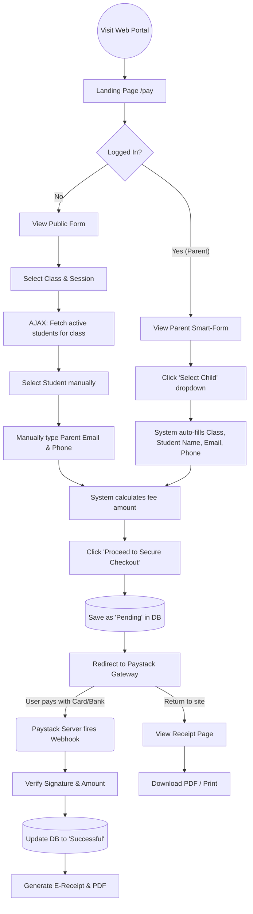
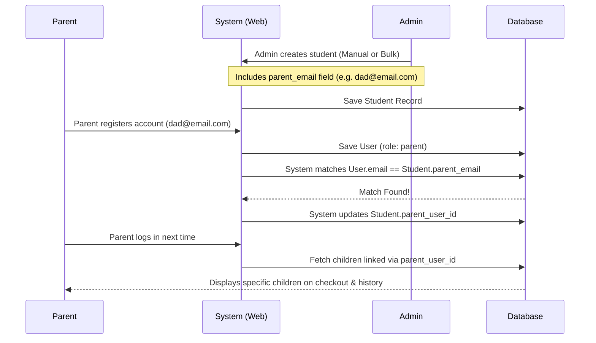

# Spiritan DFMS - User Flow Diagrams

This document illustrates the primary paths users—both Parents and Administrators—take through the digital financial system.

---

## 1. The Parent / Payer Journey

This diagram covers the process of discovering the payment portal, making a payment, and retrieving a receipt. It handles both logged-in parents (who get a streamlined experience) and anonymous guests (like older siblings or relatives paying on a child's behalf).



---

## 2. The Administrator Journey

This diagram illustrates how school administrators interact with the system to set up the academic year, manage students, and track financial reports.

```mermaid
flowchart TD
    AdminLogin((Admin Login)) --> Dash[Admin Dashboard]
    
    Dash --> Setup{Academic Setup}
    
    %% Setup Branch
    Setup --> Sessions[Manage Academic Sessions]
    Setup --> Terms[Manage Terms]
    Setup --> Classes[Manage Classes]
    Setup --> Purposes[Manage Payment Descriptors]
    Setup --> Fees[Define Fees per Class & Term]
    
    Dash --> Students{Student Mgmt}
    
    %% Student Branch
    Students --> AddSingle[Add Individual Student]
    Students --> Bulk[Bulk CSV/Excel Upload]
    Bulk --> Validator[System validates rows & checks class names]
    Validator --> CreateOrUpdate[(Update existing or Create new)]
    
    Dash --> Finances{Financial Tracking}
    
    %% Finances Branch
    Finances --> Record[Record Manual Payment (Cash/Transfer)]
    Finances --> ViewAll[View all online/offline payments]
    Finances --> Receipt[Re-print missing receipts]
    
    Dash --> Reports[Export Ledger]
    Reports --> CSV[Download as CSV]
    Reports --> Exl[Download as Excel]
```

---

## 3. The Registration / Linking Process

How do students get linked to their parent's online accounts?


