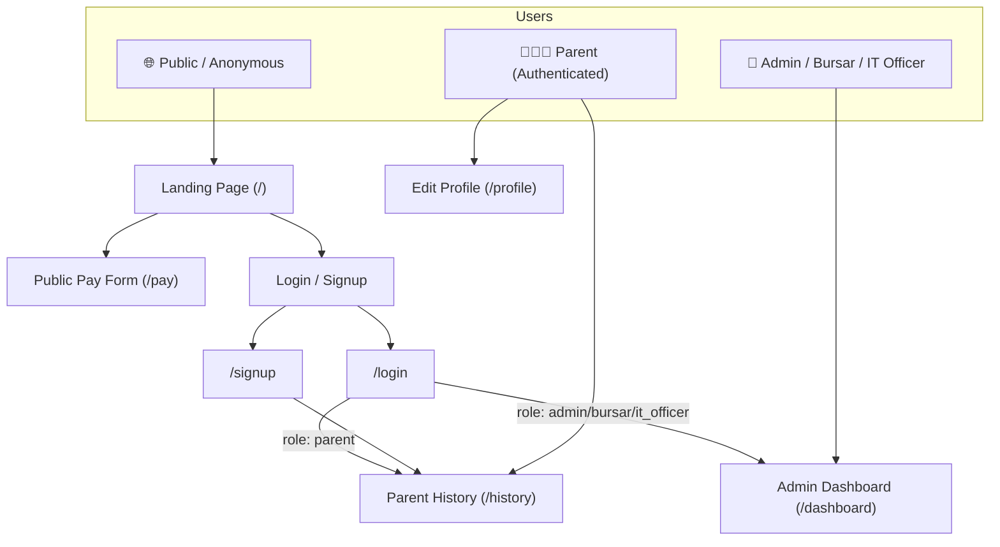
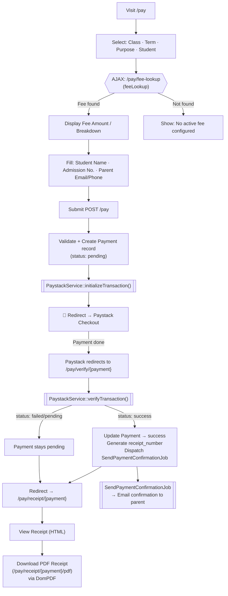
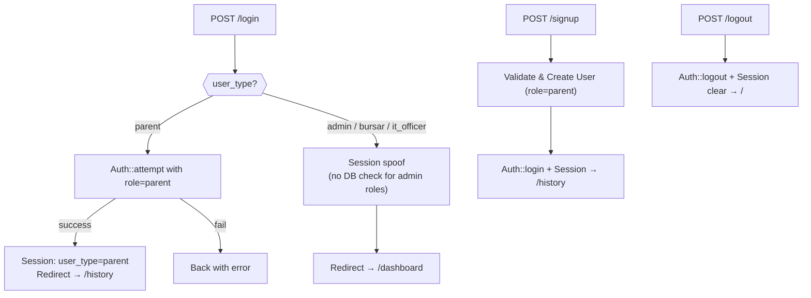
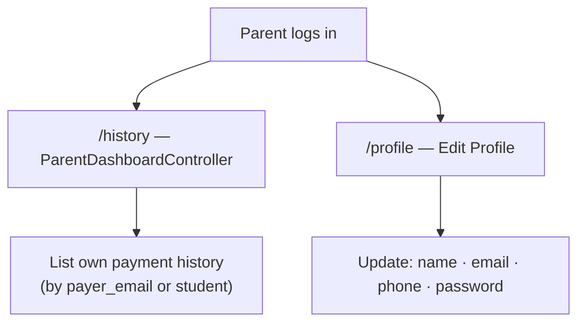
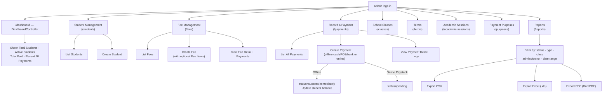
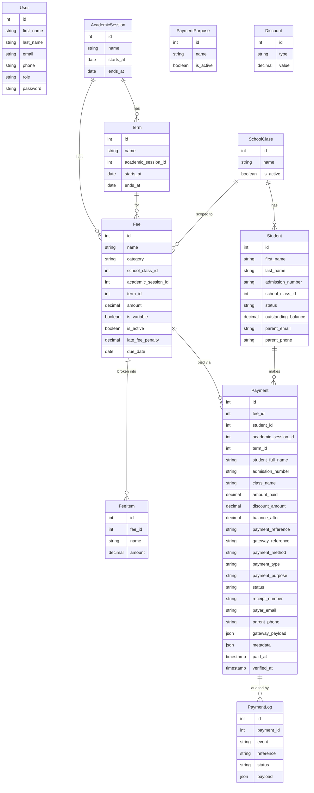
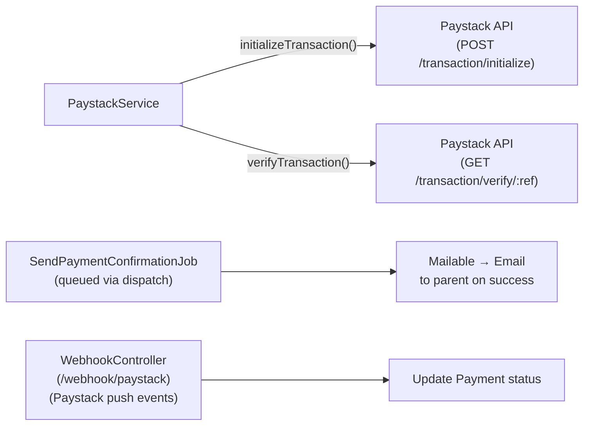

# Spiritan Financial System — Complete App Flowchart

> **Stack:** Laravel 10 · Blade · MySQL · Paystack · DomPDF

---

## System Overview

---

## 🌐 Public Payment Flow

---

## 🔐 Authentication Flow

---

## 👨‍👩‍👧 Parent Portal

---

## 🏫 Admin Dashboard

---

## 🗄️ Data Model Relationships

---

## ⚙️ Services & Jobs

